# All the Mods 11: The Chronosmith's Forge ⚙️🌀

[](https://toniperez06.github.io/Atm11-Endgame-Playbook/)

**Transcend the Boundaries of Modded Minecraft – Forge Your Own Timeline**

---

## 🌌 What Is This?

*All the Mods 11: The Chronosmith's Forge* is not merely a modpack—it is a **chrono-mechanical universe** where time itself becomes a resource, a tool, and a puzzle. Inspired by the vast lineage of ATM modpacks, this 1.20.2 journey invites players to become **Chronosmiths**: artisans who warp, compress, and reforge the fabric of gameplay by mastering temporal mechanics alongside classic tech, magic, and exploration.

Think of it as a **sandbox cathedral**: every block is a prayer to possibility, every machine a hymn to automation, and every dimension a parable of discovery. Whether you are a veteran seeking fresh paradoxes or a newcomer wanting a curated yet expansive experience, this repository serves as your blueprint, your lore book, and your community's hearth.

---

## 🔮 The Core Vision (Beyond the Obvious)

Most modpacks give you progression. We give you **narrative physics**.  
Instead of linear advancement, *The Chronosmith's Forge* introduces:

- **Temporal Flux Mechanics** – Manage a personal "chrono-bar" that accelerates or decelerates mob spawning, crop growth, and machine processing. Overuse creates temporal rifts.
- **Echo Crafting** – Every item you craft leaves a "temporal echo"; craft multiples of the same item cheaply but risk destabilizing your local timeline, attracting "Paradox Wraiths."
- **The Æther-Forged Anvil** – Combine items from different mod families (e.g., Thermal Expansion + Ars Nouveau + Botania) into unique artifacts with procedural names and effects.
- **A Custom Questline: "The Chronosmith's Testament"** – 12 chapters of lore-driven tasks that teach temporal mechanics without handholding.

This repo is your **primary documentation hub**, release source, and **progression guide** for all things ATM11.

---

## 📦 Quick Access

[](https://toniperez06.github.io/Atm11-Endgame-Playbook/)

| Platform | Status | Emoji |
|----------|--------|-------|
| Windows 10/11 | ✅ Tested | 🪟 |
| macOS (Apple Silicon) | ✅ Tested | 🍎 |
| macOS (Intel) | ✅ Tested | 💻 |
| Linux (Ubuntu/Fedora) | ✅ Tested | 🐧 |
| Steam Deck (Proton) | ✅ Verified | 🎮 |

---

## 🧭 Navigation Map (Repository Structure)

```mermaid
graph TD
    A[Repository Root] --> B[Release Assets]
    A --> C[Progression Guide]
    A --> D[Config Templates]
    A --> E[Custom Quests JSON]
    A --> F[Server Pack Scripts]
    B --> B1[Client Installer]
    B --> B2[Server Distro]
    B --> B3[Resource Pack Overlay]
    C --> C1[Temporal 101: Beginner Arc]
    C --> C2[The Echo Crafter's Lexicon]
    C --> C3[Paradox Management for Mid-Game]
    C --> C4[Chronosmith's Endgame: The Singularity Forge]
    D --> D1[Client Profile Example]
    D --> D2[Server Properties Sample]
    D --> D3[KubeJS Script Snippets]
    E --> E1[Chapter 1-4: Awakening]
    E --> E2[Chapter 5-8: The Æther Rift]
    E --> E3[Chapter 9-12: The Chronosphere]
    F --> F1[start-tmux.sh]
    F --> F2[Docker Compose Sample]
```



---

## 🛠️ Feature Palette (The Chronosmith's Toolkit)

### 🔥 Responsive UI (Client & Admin Panel)
- **Dynamic HUD** that adapts to your chrono-bar flux level.
- **Web dashboard** (optional) for server operators to monitor temporal stability across all players.
- **Multilingual Quest Book** – supports English, German, Japanese, Russian, and French out of the box. Community translations welcome.

### 🌐 Multilingual Support
All quest text, tooltips, and in-game books are locale-aware. Adding a new language requires only a YAML file in `/lang`—no mod code restructure needed.

### ⏰ 24/7 Community & Support
- Dedicated **discord bridge bot** in repo (config only, token not included).
- **Automated issue triage** via GitHub Actions that labels time-sensitive bugs.
- **Progression coaches** (community volunteers) who answer "I'm stuck at Temporal Tear 4" queries.

### 🧠 OpenAI & Claude API Integration (Optional)
- **Smart Recipe Hints** – When paused, press `H` to ask an LLM (OpenAI or Claude) for a natural-language hint about your current quest. *(API key managed client-side in a local `.env`)*
- **Lore Generation** – Server operators can toggle an AI narrator that writes custom journal entries based on player actions.
- **Automated Changelog Poetry** – Every release includes a brief, AI-generated stanza describing the update in thematic fashion.

### 🧩 Example Profile Configuration (Client)

```json
{
  "chronosmith": {
    "flux_preference": "balanced",
    "echo_visualization": "particle_ring",
    "ui_language": "en_us",
    "ai_assistant": {
      "provider": "openai",
      "model": "gpt-4o-mini",
      "temperature": 0.3
    }
  }
}
```

Place this as `config/atm11-profile.json` before launching.

### 💻 Example Console Invocation (Server)

```bash
java -Xms8G -Xmx12G -jar forge-1.20.2-48.1.0.jar nogui \
  -Dchronosmith.temporalInitDelay=1200 \
  -Dchronosmith.allowAIFallback=true
```

Server will boot with a 20-minute warm-up period before temporal mechanics activate—ideal for new worlds.

---

## 📜 License & Legalities

This repository is distributed under the **MIT License**.  
You are free to fork, redistribute, or create derivative works, provided you retain attribution to the original project.

[](https://opensource.org/licenses/MIT)

---

## ⚠️ Disclaimer (Read This Carefully)

**"All the Mods 11: The Chronosmith's Forge"** is an unofficial community project. It is not affiliated with, endorsed by, or sponsored by Mojang AB, Microsoft Corporation, or the official CurseForge All the Mods team.  

- We provide **configuration files, documentation, and compiled scripts** only.  
- Actual mod jars must be obtained legally from their respective authors.  
- Temporal mechanics may cause unexpected behavior when combined with certain mods—back up your worlds before enabling advanced paradox features.  
- The AI integration features (OpenAI/Claude) are **opt-in** and require your own API keys. No telemetry is sent to third parties by default.  
- **Release 2026 builds** are stable for 1.20.2; future updates may break Chronosmith-specific mechanics.

*© 2026 The Chronosmith Collective – Time is the only currency we don't hoard.*

---

## 📦 Download Again (Just in Case)

[](https://toniperez06.github.io/Atm11-Endgame-Playbook/)

---

**Explore. Experiment. Entangle time itself.**  
*The forge is lit. The chronosphere awaits.* 🪐